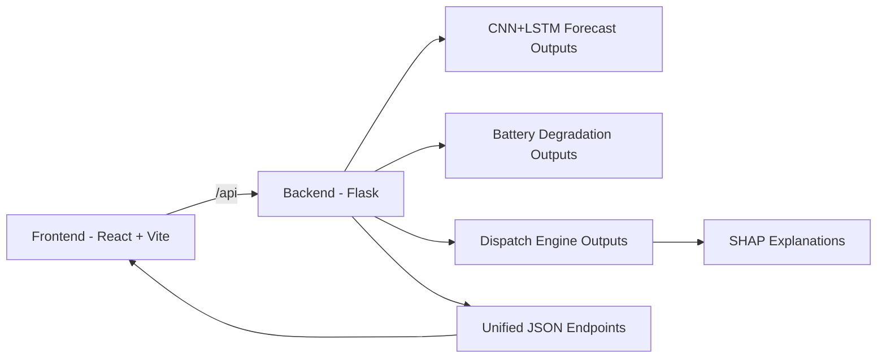

<div align="center">

# XplainableAI
### Explainable Intelligence for Rural Microgrid Operations

A full-stack platform that combines forecasting, battery diagnostics, and explainable dispatch decisions into one operational dashboard.

</div>

---

## 1. What This Project Does

XplainableAI helps monitor and optimize microgrid performance by combining three capabilities:

- Probabilistic energy forecasting for solar, wind, and load demand.
- Battery fleet health analysis with anomaly-aware metrics.
- Explainable dispatch recommendations with driver-level reasoning.

The frontend is built for decision visibility, while the backend orchestrates data, model outputs, and API responses.

---

## 2. System Snapshot



---

## 3. Monorepo Layout

```text
XplainableAi/
  backend/                               Flask API server
  frontend/                              React dashboard app
  CNN+LSTM-FORECASTER/                   Forecast model assets and outputs
  dispatch_engine/                       Dispatch model artifacts and explanations
  ZerodayExplorers_BatteryDegradation/   Battery analysis outputs
```

---

## 4. Frontend Overview

### Main Purpose

The frontend delivers a production-style dashboard for operators and analysts to:

- View forecast trends and uncertainty bands.
- Monitor battery health and anomaly indicators.
- Inspect dispatch mode confidence and recommendations.
- Browse explainability artifacts from model outputs.

### Frontend Stack

- React
- Vite
- Tailwind CSS
- React Router
- Recharts
- Supabase JS

### Frontend Routes

- /landing
- /
- /forecast
- /battery
- /dispatch
- /explainability
- /scenarios
- /settings

---

## 5. Backend Overview

### Main Purpose

The backend aggregates model outputs and exposes API endpoints consumed by the frontend.

### Backend Stack

- Flask
- Flask-CORS
- Pandas
- NumPy
- XGBoost
- SHAP
- scikit-learn
- Gunicorn

### API Base

- http://localhost:5000/api

### Key Endpoints

- GET /health
- GET /dashboard
- GET /forecast
- GET /forecast/summary
- GET /battery
- GET /battery/fleet
- GET /battery/cycles
- GET /battery/ids
- GET /battery/plots/<filename>
- POST /dispatch/predict
- GET /dispatch/explanations
- GET /explain/images/<filename>
- GET /explain/available

---

## 6. Local Development

### Prerequisites

- Node.js 18+
- Python 3.10+
- npm and pip

### Step A: Run Backend

```powershell
cd backend
python -m venv venv
venv\Scripts\activate
pip install -r requirements.txt
python app.py
```

Backend default URL:
- http://localhost:5000

### Step B: Run Frontend

```powershell
cd frontend
npm install
npm run dev
```

Frontend default URL:
- http://localhost:5173

The frontend dev server proxies /api requests to the backend on port 5000.

---

## 7. Environment Configuration

Create frontend/.env with:

```env
VITE_SUPABASE_URL=your_supabase_project_url
VITE_SUPABASE_ANON_KEY=your_supabase_anon_key
```

If values are missing, the frontend still loads but authentication features warn and use placeholders.

---

## 8. Data and Model Dependencies

The backend reads artifacts from sibling folders in this workspace.

Required files and folders include:

- CNN+LSTM-FORECASTER/data/bihar_predictions.csv
- dispatch_engine/outputs/dispatch_engine.ubj
- dispatch_engine/outputs/per_sample_explanations.csv
- ZerodayExplorers_BatteryDegradation/outputs/data/battery_full_summary.csv
- ZerodayExplorers_BatteryDegradation/outputs/data/nasa_2yr_all_batteries.csv
- ZerodayExplorers_BatteryDegradation/outputs/plots

If these are missing, related endpoints return empty objects/lists or fallback errors.

---

## 9. Build Commands

### Frontend Production Build

```powershell
cd frontend
npm run build
npm run preview
```

### Backend Production Start (example)

```powershell
cd backend
gunicorn "app:create_app()"
```

---

## 10. Project Notes

- Backend and frontend are decoupled and can be deployed independently.
- API prefix is consistently /api for all backend modules.
- Explainability endpoints can serve both image and html artifacts.

---

## 11. Contribution Workflow

1. Create a feature branch.
2. Keep backend and frontend changes scoped and documented.
3. Validate frontend build and backend startup before opening a pull request.
4. Include endpoint or UI impact notes in your commit/PR message.

---

## 12. License

MIT License

Copyright (c) 2026 XplainableAI Contributors

Permission is hereby granted, free of charge, to any person obtaining a copy
of this software and associated documentation files (the "Software"), to deal
in the Software without restriction, including without limitation the rights
to use, copy, modify, merge, publish, distribute, sublicense, and/or sell
copies of the Software, and to permit persons to whom the Software is
furnished to do so, subject to the following conditions:

The above copyright notice and this permission notice shall be included in all
copies or substantial portions of the Software.

THE SOFTWARE IS PROVIDED "AS IS", WITHOUT WARRANTY OF ANY KIND, EXPRESS OR
IMPLIED, INCLUDING BUT NOT LIMITED TO THE WARRANTIES OF MERCHANTABILITY,
FITNESS FOR A PARTICULAR PURPOSE AND NONINFRINGEMENT. IN NO EVENT SHALL THE
AUTHORS OR COPYRIGHT HOLDERS BE LIABLE FOR ANY CLAIM, DAMAGES OR OTHER
LIABILITY, WHETHER IN AN ACTION OF CONTRACT, TORT OR OTHERWISE, ARISING FROM,
OUT OF OR IN CONNECTION WITH THE SOFTWARE OR THE USE OR OTHER DEALINGS IN THE
SOFTWARE.

